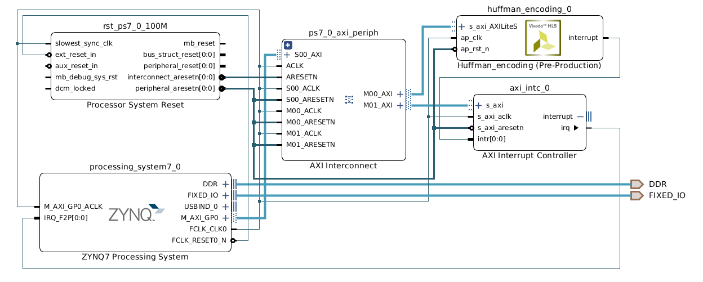

# huffman-encoding-core
Huffman encoding core (Vivado HLS)

### Overview


### How to run

#### Download source code

```bash
$ git clone https://github.com/sopynq/huffman-encoding-core.git
```

#### Compile source codes with Vivado-HLS

```bash
$ cd huffman-encoding-core
$ vivado_hls -f setup.tcl
```

### Tests

`tests` folder contains some test cases which should be run on `PYNQ` board. If you are running a bare zynq board you should write drivers yourself

### Reference

[pp4fpga](https://github.com/KastnerRG/pp4fpgas) Chapter 11.
